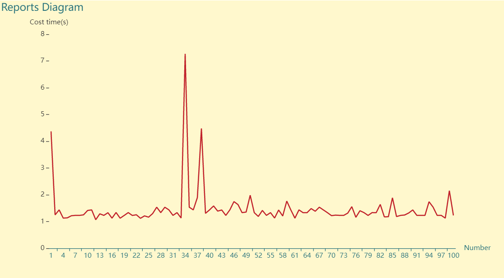

# ptest
<p align="center">
<a href="https://pkg.go.dev/github.com/mehditeymorian/koi/v3?tab=doc"target="_blank">
    
</a>


</p>

<p align="center">

</p>

### <b>a lightweight Http benchmarking tool for testing performance</b>

# Documentation

## Install
``` go
go install -v github.com/erfanmomeniii/ptest@latest
```

## Quick Start

The following examples demonstrates how to generate report for specific url :
```
ptest run -u https://google.com
```

✅ You can also see diagram of output reports by using the following command:
```
ptest run -u https://google.com -d true
```
here you can see an example of generated diagram from reports:

<p align="center">

</p>

### CLI Usage

```bash
ptest [Command] [Flag]
```

| Command  | Description                   | 
|:---------|:------------------------------|
| help     | Help about any command        |
| run      | Command for starting to run   |


| Flag             &nbsp;&nbsp;&nbsp;&nbsp;&nbsp;&nbsp;&nbsp;&nbsp;&nbsp;&nbsp;&nbsp;&nbsp;&nbsp;&nbsp;&nbsp;&nbsp; &nbsp;&nbsp;&nbsp;&nbsp;&nbsp;&nbsp;&nbsp;&nbsp;&nbsp;&nbsp; | Description                                                                                | Type          | Default                 |
|:-------------------------------------------------------------------------------------------------------------------------------------------------------------------------------|:-------------------------------------------------------------------------------------------|:--------------|:------------------------|
| `-u, --url`                                                                                                                                                                    | Target website URL.                                                                        | `string`      | https://google.com      |
| `-c, --count`                                                                                                                                                                  | Total iteration count                                                                      | `int`         | `1`                     |
| `-d, --diagram`                                                                                                                                                                | For defining that should draw diagram or not                                               | `bool`        | `false`                 |
| `-b, --body`                                                                                                                                                                   | Body for the HTTP request                                                                  | `string`      | `''`                    |
| `-m, --method`                                                                                                                                                                 | Http request method. Available methods  are *GET, POST, PUT, DELETE, HEAD, PATCH, OPTIONS* | `string`      | `GET`                   |
| `-h, --header`                                                                                                                                                                 | Headers of the request                                                                     | `stringArray` | `''`                    |
| `-t, --timeout`                                                                                                                                                                | Timeout for each HTTP call                                                                 | `int`         | 10000000000(10 seconds) |
